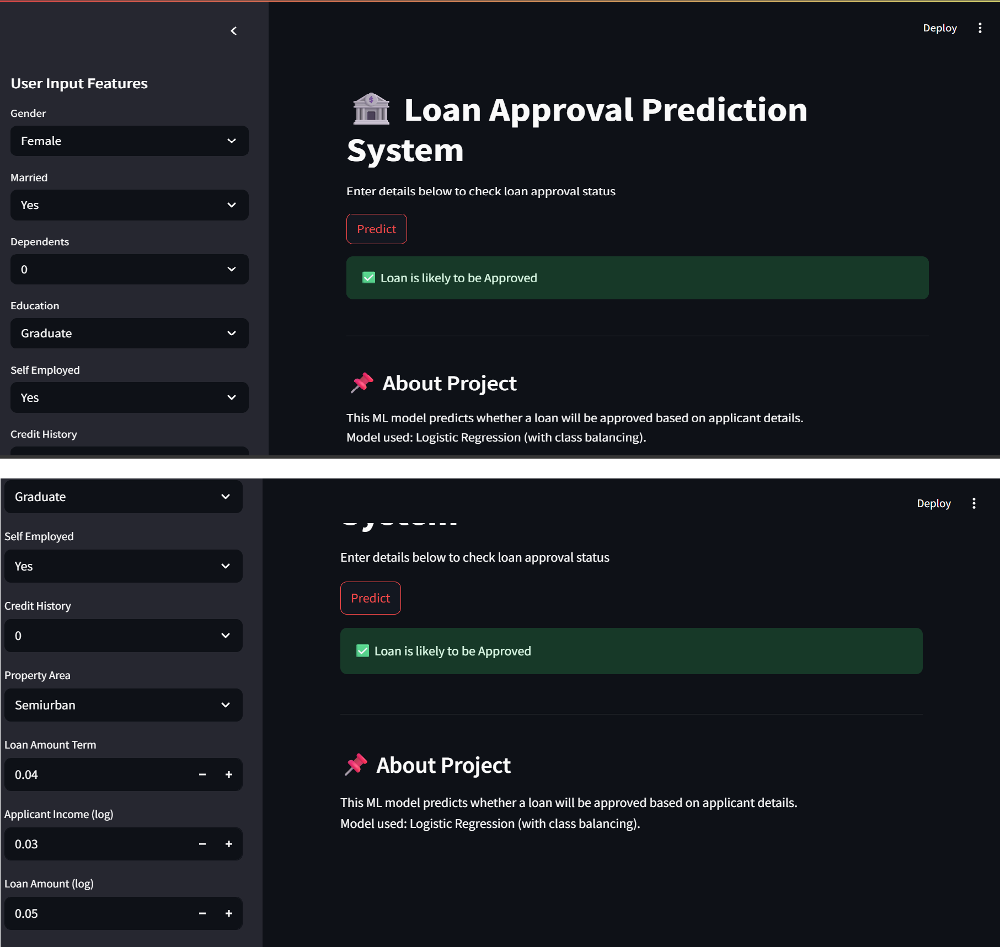

# 🏦 Loan Approval Prediction System

## 📌 Project Overview
This project predicts whether a loan application will be approved or not using Machine Learning. It analyzes applicant details such as income, credit history, and demographics.

---

## 🚀 Features
- Data cleaning and preprocessing
- Handling missing values
- Feature engineering (log transformation)
- Model comparison:
  - Logistic Regression
  - Decision Tree
- Final model: Logistic Regression (better performance)
- Streamlit web app for real-time prediction

---

## 🛠️ Tech Stack
- Python
- Pandas, NumPy
- Scikit-learn
- Streamlit

---

## 🎯 Model Performance
- Accuracy: ~78%
- Improved recall using class balancing

---

## 💻 How to Run
```bash
cd c:/ml_project
streamlit run app.py
```

## App Screenshot

### Home Screen 


### Prediction result 


